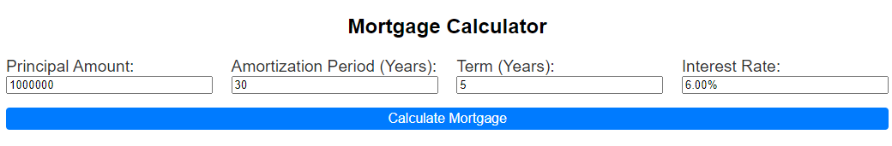

# Mortgage Calculator

This is a basic mortgage amortization table calculator to assist a user to visually understand how much money from each payment goes towards interest and how much goes to principal.

## Entry options:

## V1 UI:

Principal: Put in the Loan amount. i.e. 1000000.

Amortization (Years) : How many years is the total length of the loan. i.e. 30 years.

Term (Years) : How long is the term you wish to display on screen. i.e. 5 years.

Interest rate (Percent) : Put in what the interest rate is. i.e. 6.00%

Calculate Mortgage Button : Press, once the above is filled in to generate the Mortgage Breakdown and Cumulative Payments vs Remaining Balance graphs.

### RUN LOCALLY

To try it out use the following command in Terminal:

python -m http.server 8000 --bind 127.0.0.1
